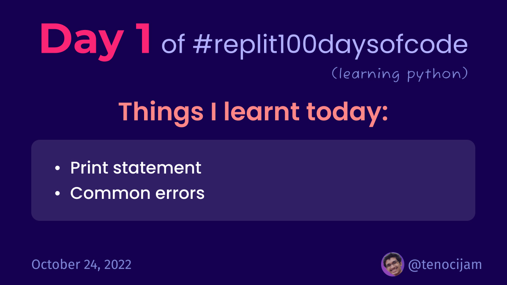

# Day 1: October 24, 2022



## Things I learnt today

### Print statement:
```python
print("Hello world!")
```
- we can use single `''` or double quotes `""` to display a text (string) on a single line
- we can use triple quotes to display a multiline text with gaps or line breaks

### Common errors:
- Name error: we will see this error message if we type the name of a function or anything incorrectly
- Syntax error: it occurs when there is a mistake in the way we have written our code

✅ Completed Project 1: Print into the World

[Join me on Replit](https://join.replit.com/python)