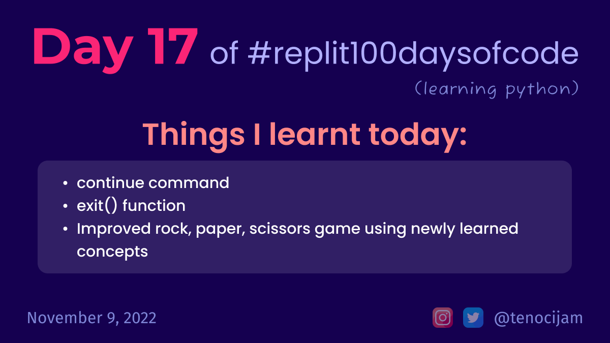

# Day 17: November 9, 2022

## Things I learnt today

- continue command:
	- It stops executing code in the loop and starts at the top of the loop again.
- exit() command:
	- It completely stops the program and it will not run any more lines of code.

[My repl link](https://replit.com/@tenocijam/day17100-days#main.py)