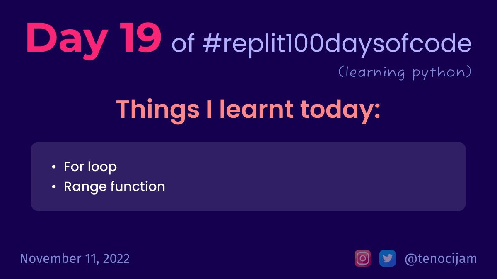

# Day 19: November 11, 2022


## Things I learnt today
```python
for i in range(10):
  print(i)
```
- For loop:
	- If we know how many times we want to loop, we can make use of the for loop
- Range function:
	- The range function creates a list of numbers in the range we specify.
	- If we only give it one number, it will start at 0 and move to a state where the final number is one less than the number in the brackets. 

[My repl link](https://replit.com/@tenocijam/day-19100-days#main.py)