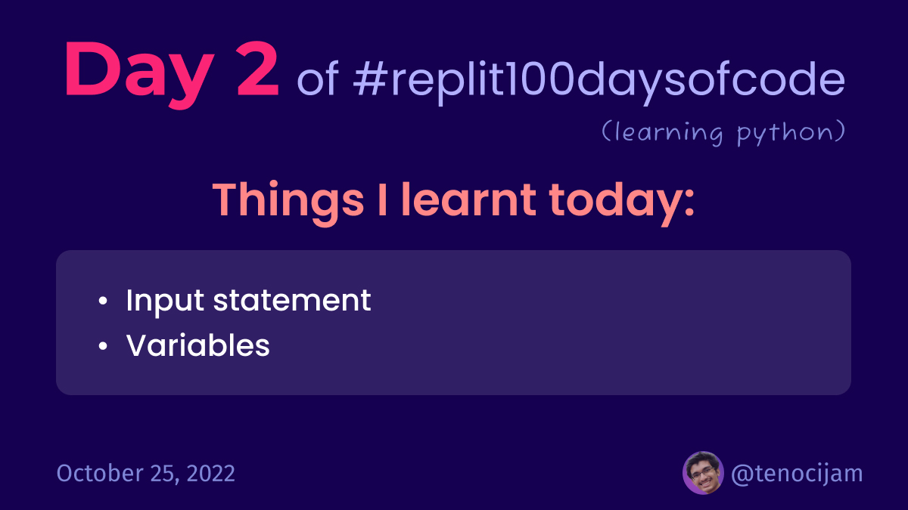

# Day 2: October 25, 2022


## Things I learnt today

### Input statement:
```python
input("What is your name? ")
```
This will show the message in the console then wait until the user has typed something into the console and pressed enter

### Variables:
```python
# the value user types gets stored in a variable called name
name = input("What is your name? ")
```
Variable is a value that we can use to name and store data.
Variables can't have spaces in them.
In python, we mostly use snake case (my_variable_name) to name the variables.