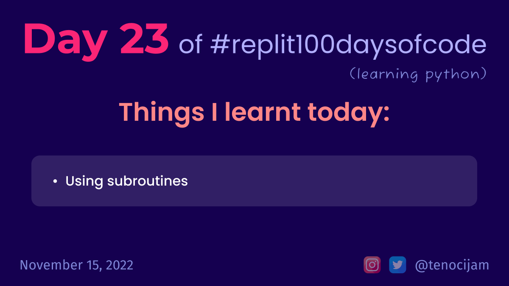

# Day 23: November 15, 2022

## Things I learnt today

- Subroutine:
	- we can define a subroutine containing some piece of code, and later we can call the subroutine using its name to run all the code inside it

[My repl link](https://replit.com/@tenocijam/day23100-days#main.py)