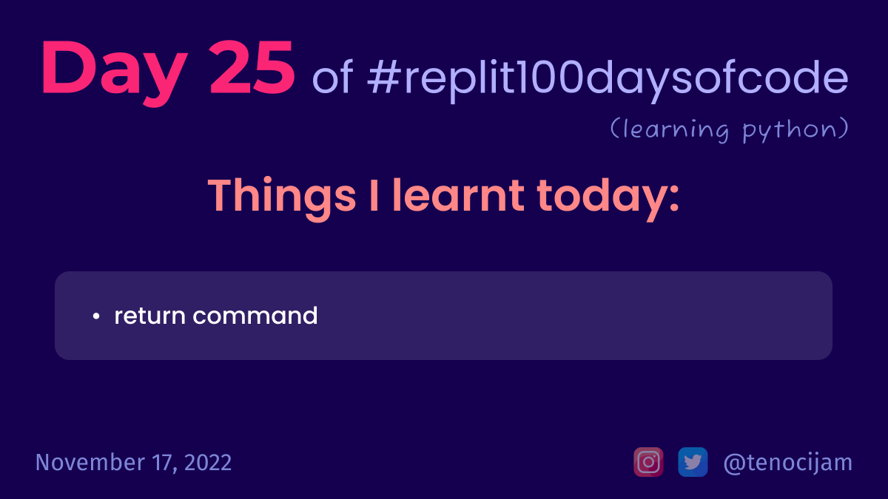

# Day 25: November 17, 2022

## Things I learnt today

- Return Command
	- The return command sends some information back to the part of the code that called it.
	- This means the function call is replaced with whatever was returned.

[My repl link](https://replit.com/@tenocijam/day-25100-days-of-code#main.py)