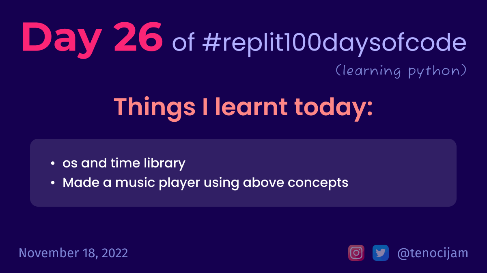

# Day 26: November 18, 2022

## Things I learnt today

- os and time library
	- we can use os library to clear the console using `os.system("clear")`
	- time library can be used to pause the execution of a program for a specific amount of time.
- Made music player using above concepts

[My repl link](https://replit.com/@tenocijam/day26100-days-of-code#main.py)