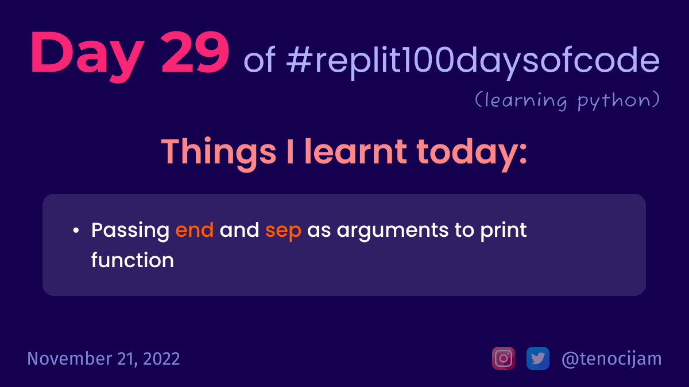

# Day 29: November 21, 2022

## Things I learnt today

- Passing `end` and `sep` as arguments to print function
	- `end` is used to specify what should be there at the end of the print statement
	- `sep` can be used to define the seperator used when concatening different things

[My repl link](https://replit.com/@tenocijam/day29100-days#main.py)