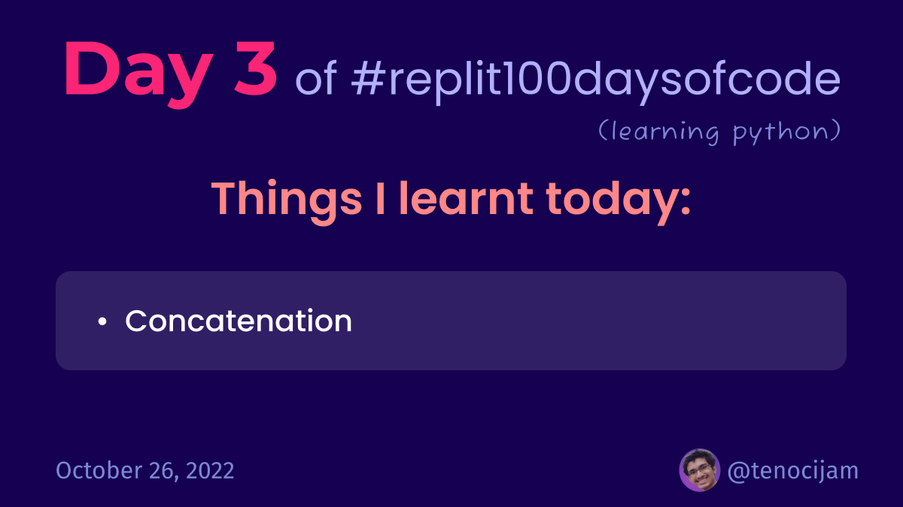

# Day 3: October 26, 2022


## Things I learnt today

### Concatenation:
```python
name = input("What is your name? ")

print("Hello,", name)
# INPUT:
# What is your name? John

# OUTPUT:
# Hello, John
```
It is used to combine text (string) and variables together into a single sentence.