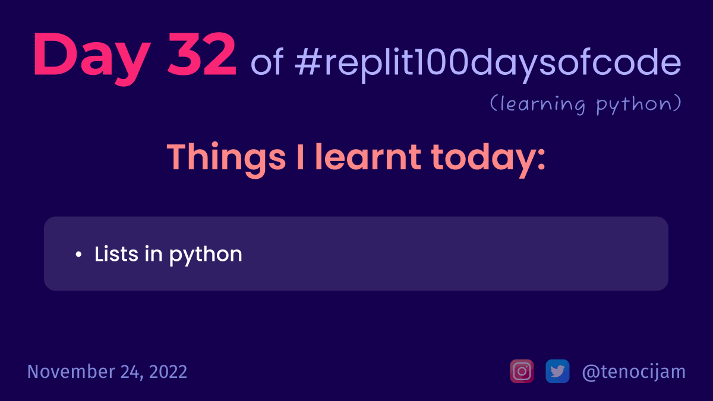

# Day 32: November 24, 2022

## Things I learnt today

- Lists
	- We can store values of any data type in our list
	- Lists in python, like many languages, are zero indexed (i.e. starts counting from 0)
	- Syntax to create a list: `mylist = ["itemone", True, 3, "four"]`
	- To print an item in the list, we can use: `print(mylist[2])` => this will print out `3`

[My repl link](https://replit.com/@tenocijam/day-32100-days#main.py)