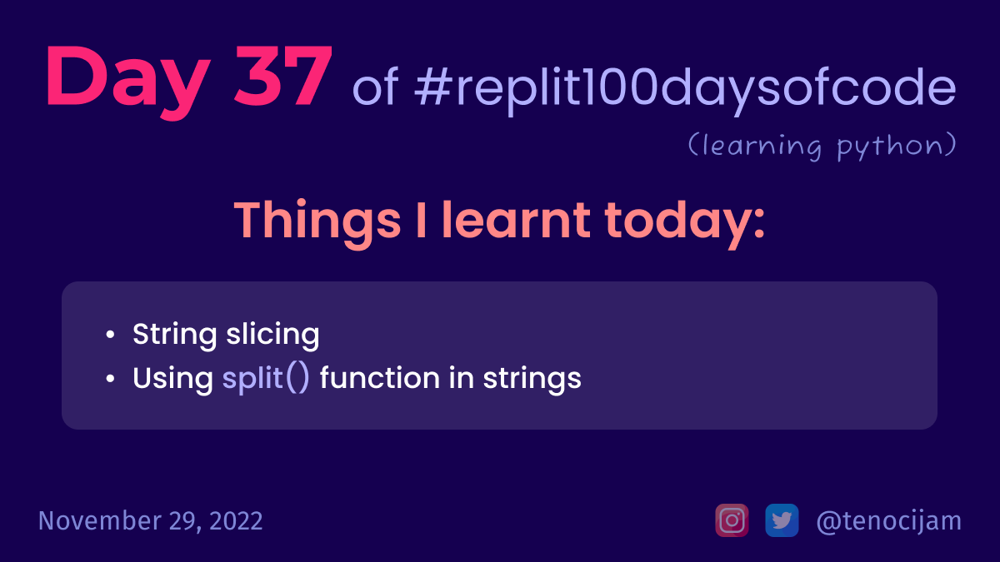

# Day 37: November 29, 2022

## Things I learnt today

- String slicing
	- for example, let `my_string = "Hello there my friend.`
	- `print(my_string[0])` will print only first letter of string (output: H)
	- `print(my_string[6:11])` will print only characters from 6th position to 11th position(exclusive) (output: there)
	- `print(my_string[0:6:2])` will print all characters till 6th position(exclusive) with a gap of 2 (output: Hlo)
- Using `split()` function in strings

[My repl link](https://replit.com/@tenocijam/Day37100Days#main.py)