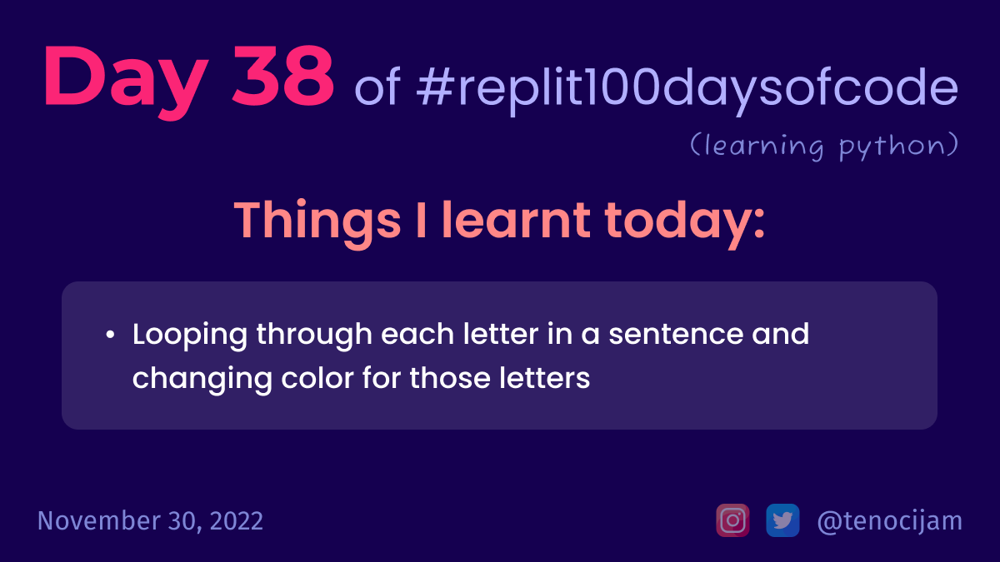

# Day 38: November 30, 2022

## Things I learnt today

- Looping through each letter in a sentence and changing color for those letters
	- every letter from the letter 'r' in a sentence will be red
	- every letter from the letter 'b' in a sentence will be blue
	- every letter from the letter 'g' in a sentence will be green
	- every letter from the letter 'p' in a sentence will be purple
	- every letter from the letter 'y' in a sentence will be yellow

[My repl link](https://replit.com/@tenocijam/Day38100Days#main.py)