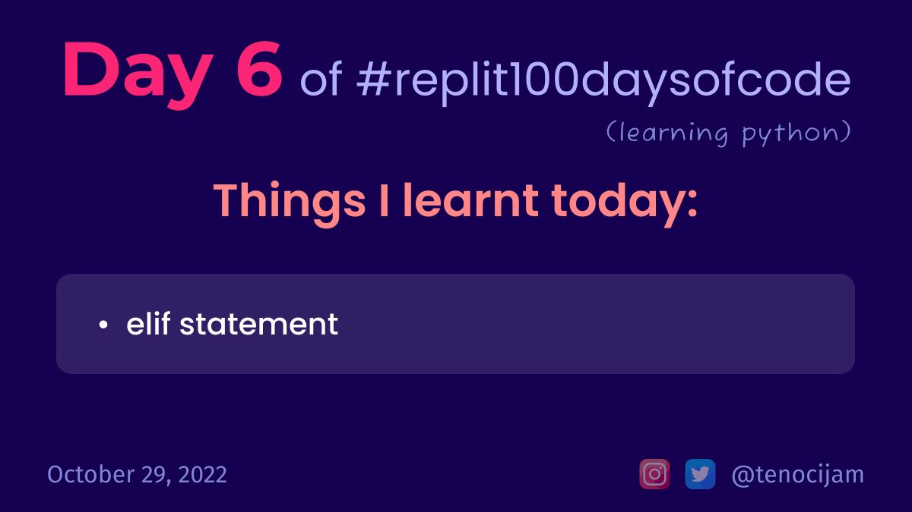

# Day 6: October 29, 2022


## Things I learnt today

### elif statement:

Example code:
```python
name = input("What is your name? ")

if name == "John":
  	print("Hello John!")
elif name == "David":
	print("Hello David!")
else:
  	print("Hi")

# **Case 1**
# Input: John
# Output: Hello John!
# 
# **Case 2**
# Input: David
# Output: Hello David!

# **Case 3**
# Input: Jane
# Output: Hi
```

The elif command (stands for 'elseif') allows us to ask many questions using the same input! 

We can have as many elif statements as we want, but they must go in between if and else and have the same indentation.